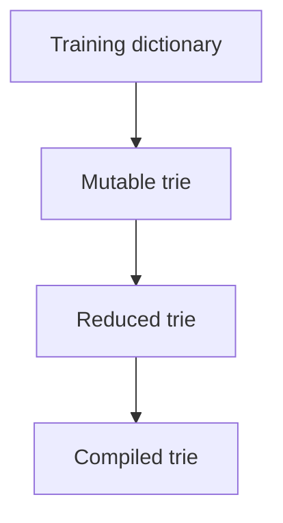

# Architecture

This document explains the structural architecture of **Radixor**: what data is stored, how it flows through the build pipeline, and how runtime lookup works once a compiled trie has been produced.

## Java component boundaries

| Component | Responsibility |
|---|---|
| Root Radixor core | Patch commands, dictionary parser, trie construction/lookup, descriptor and registry APIs, loaders; no language data |
| Individual model module | Immutable source input and license; publishes one independently versioned resource JAR |
| `StemmerModelRegistry` | Deterministic index/descriptor discovery and selection by model ID or language default |
| `StemmerModelDescriptor` | Immutable public view of validated runtime identity, format, resource, checksum, and source URL |
| Model convention plugin | Validates inputs and generates the resource namespace, descriptor, index, license, and publication |
| Standard aggregate | POM-only transitive runtime dependencies for one default per language |
| Verification classpaths | Direct individual-model dependencies for tests, quality evaluation, and JMH, including optional PoliMorf |
| Models BOM | POM-only recommended individual model versions in Maven dependency management |
| Documentation staging | Maintained `docs/` plus generated catalog under `build/mkdocs-source/` |
| Release workflows | Independent core, one-model, and catalog publication boundaries |

Read [Model Selection and Loading](model-selection-and-loading.md) for executable application examples and [Stemmer Models](stemmer-models.md) for artifact maintenance.

## Python component boundaries

The Python distribution is a separate native implementation rather than a JVM
wrapper. The `radixor` wheel contains the Rust/PyO3 runtime but no language
data. Its mandatory `radixor-models-standard` dependency supplies 20 validated,
precompiled, GZip-compressed version 7 `.rxc` tries. It does not use Java model
JARs, `ServiceLoader`, descriptors, or the Java registry.

`Stemmer("<alias>")` resolves and synchronously loads a compiled standard model;
it does not parse a textual dictionary at application startup.
`radixor.compile(...)` remains available for application-owned textual
dictionaries, and `Stemmer(compiled=...)` loads the resulting version 7
artifact. The Java, Python, and Python-C in-memory layouts are intentionally different;
the shared dictionary syntax and version 7 binary stream are their
interoperability boundaries. See [Radixor for Python](python/index.md) and
[Compiling Dictionaries in Python](python/model-compilation.md).

## Runtime model discovery and loading

The implemented sequence is:

1. use the thread context `ClassLoader`, or an explicit non-null loader;
2. enumerate every `META-INF/radixor/models.index` with `ClassLoader.getResources(...)`;
3. sort index URLs and validate every descriptor path;
4. read descriptor resources and required properties;
5. validate model ID, language, exact resource namespace, checksum syntax, format name, and format version;
6. sort descriptors by model ID and reject duplicate IDs;
7. resolve either `Language.defaultModelId()` or an exact explicit model ID;
8. open the declared model resource with the descriptor's discovering loader;
9. compare SHA-256 over the compressed bytes;
10. decompress GZip and parse UTF-8 Radixor dictionary rows;
11. build and reduce a `FrequencyTrie`;
12. optionally compile stored patch strings into `CompiledPatchCommand` values for the language-oriented compiled API.

Descriptor discovery verifies resource presence before selection. Byte-level checksum verification happens when the selected model is loaded. The registry never scans arbitrary JAR contents and never selects “the first model for a language.”

### Default Polish resolution

`StemmerPatchTrieLoader.Language.PL_PL` declares `pl-pl-unimorph` in the enum constructor. A language-oriented load creates a context-loader registry and calls `requireDefault(PL_PL)`. If that ID is absent, loading stops with `StemmerModelNotFoundException` naming `org.egothor:radixor-model-pl-pl-unimorph:<version>`.

### Explicit PoliMorf resolution

`registry.require("pl-pl-polimorf")` addresses the alternative directly. It neither changes nor consults the Polish default. Both descriptors may coexist; duplicate declarations of either same ID are rejected.

## Version axes

| Version | Owned by | Compatibility purpose |
|---|---|---|
| Core version | Root Git-derived release | Java implementation and public API |
| Model artifact version | Each `model-version.txt` | One independently published model JAR |
| Catalog version | `models/catalog-version.txt` | Standard aggregate and BOM recommendation set |
| Source dictionary version | Module provenance | Upstream lexical data lineage |
| Model format version | Descriptor and registry | Loader compatibility for packaged dictionary representation |

No equality relationship is implied between these values.

## Build topology and generated output

`models/model-projects.properties` is the single Gradle-readable topology list for the 21 individual model projects and their default or optional aggregate role. Per-model build scripts and generated descriptors remain authoritative for language, resource, provenance, checksum, and model-specific metadata. `settings.gradle`, root verification classpaths, the standard POM, and BOM constraints all derive membership from the topology list.

Gradle implicitly creates the lifecycle parent `:models` because child paths are nested. It has no build script, applied project plugin, Maven coordinate, publication, or archive. The root CycloneDX plugin exposes direct-task instances to subprojects internally; every subproject instance is disabled, so only root `:cyclonedxDirectBom` can generate an SBOM. The ignored path `models/build/` is generated output, not a module, and the supported build does not write reports there. Root aggregate reports, including `verifyJmhModelClasspath`, belong under `build/reports/models/`; each individual model retains its own outputs under `models/<model-id>/build/`.

`models/bom` is a Maven dependency BOM: it controls recommended dependency versions and adds no runtime artifacts. The root CycloneDX task produces a software bill of materials (SBOM) under `build/reports/sbom/`. These artifacts have different purposes and output locations.

## Build-time model packaging

The `org.egothor.radixor.model` convention plugin treats `src/modelInput` as immutable. `validateModelInput` checks the GZip stream, strict UTF-8, dictionary rows, ID, semantic model version, and license. `prepareModelResources` copies identical compressed bytes under `org/egothor/stemmer/models/<model-id>/stemmer.gz` and generates the descriptor, index, and packaged license under `build/`. `verifyModelDescriptor` checks the digest, while `verifyModelJar` checks the unique resource, packaged-byte digest, metadata, and dictionary-free documentation artifacts. The root `runtimeModelIntegrationTest` accepts `-PmodelId=<id>` and verifies transformation of a packaged resource into `FrequencyTrie<CompiledPatchCommand>`; PoliMorf release validation depends on this complete runtime test.

For UniMorph models, the convention validates and packages one model-specific attribution,
licensing, provenance, and contribution notice. Source and packaged notice bytes must match. The
notice identifies CC BY-SA 3.0 through its canonical URI; no project-wide CC license directory or
duplicated full legal text is used. Descriptors distinguish exact revisions from the explicit
legacy-import sentinel. UniMorph supplies morphological data; runtime patch commands and tries are
constructed by Radixor. The Java software remains BSD-3-Clause, while PoliMorf data remains under
its separately packaged BSD-2-Clause license.

## Release and security boundaries

| Tag | Publication boundary |
|---|---|
| `release@<core-version>` | Root `org.egothor:radixor` artifacts only; never model JARs |
| `model/<model-id>@<model-version>` | Exactly one matching model; never core, catalog, or other models |
| `models-catalog@<catalog-version>` | BOM and standard aggregate only; never model bytes |

License inclusion, strict metadata paths, resource presence, SHA-256 verification, unsupported-format rejection, and duplicate-ID rejection form the model integrity boundary. These checks detect packaging mistakes and corruption; model data remains non-executable dictionary input.

## The central idea

Radixor does not store final stems directly as a large flat lookup table. Instead, it stores **patch commands** that describe how a word form should be transformed into a canonical stem.

For example, if a dictionary states that `running` should reduce to `run`, the final runtime artifact does not need to store a full redundant `running -> run` output string entry in the simplest possible form. It can store a compact transformation command that expresses how to turn the source form into the target form.

That matters because many words share similar transformation patterns. Once those mappings are organized in a trie and compiled into a canonical structure, the result is much smaller and more reusable than a naive direct-output table.

## Trie construction flow

The full build-time flow is:



Each stage has a different purpose.

### Dictionary input

The textual dictionary groups known word forms under a canonical stem:

```text
run	running	runs	ran
connect	connected	connecting	connection
```

The first column is the canonical stem. The following tab-separated columns are known variants.

### Patch-command generation

Each variant is converted into a patch command that transforms the variant into the stem.

Conceptually:

```text
running -> <patch> -> run
runs    -> <patch> -> run
ran     -> <patch> -> run
```

If `storeOriginal` is enabled, the stem itself is also inserted using a canonical no-op patch.

### Mutable trie construction

Those patch-command values are inserted into a mutable trie keyed by the source surface form.

### Reduction

Equivalent subtrees are merged into canonical reduced nodes.

Before a selected semantic reduction mode is applied, Radixor also performs uniform-subtree
contraction. If every reachable entry below a subtree resolves to the same preferred patch
command, that subtree can be represented as an accepting leaf for that command. Runtime lookup can
then stop at that leaf even when the input word still has remaining characters.

This is a structural optimization of preferred-result lookup. It reduces trie depth in regions
where the remaining suffix cannot change the selected command, while preserving the `get()` result
used by the standard stemmer path. The benchmark tables in `docs/benchmarks/` are based on this
contracted compiled representation.

### Compilation

The reduced structure is frozen into an immutable compiled trie optimized for runtime lookup.

## Why a trie is used

A trie is useful because many word forms share structural fragments. Instead of storing each word independently, the trie reuses paths and organizes lookup by character traversal.

A trie node can contain:

- outgoing edges,
- one or more ordered values,
- counts aligned with those values.

This is why the structure can represent both:

- a single preferred result,
- multiple competing results for the same key.

## Stage 1: Mutable construction

The mutable build-time structure is created by `FrequencyTrie.Builder`.

This stage is optimized for insertion rather than runtime lookup. As dictionary data is added, the builder accumulates:

- child edges,
- local values,
- local frequencies of those values.

Those frequencies are not incidental metadata. They later influence both result ordering and, depending on reduction mode, the semantic identity of subtrees during reduction.

### Why the build-time form is mutable

The builder must be easy to extend and easy to aggregate into. That is the opposite of what a runtime lookup structure needs.

Build-time priorities are:

- flexibility,
- accumulation of counts,
- structural growth.

Runtime priorities are:

- compactness,
- immutability,
- fast lookup.

Radixor therefore keeps construction and runtime representation strictly separate.

## What a compiled node contains

After reduction and freezing, the runtime structure uses immutable compiled nodes.

A compiled node stores:

- `char[] edgeLabels`
- child-node references aligned with those labels
- ordered value arrays
- aligned count arrays

This array-based form is compact and efficient for lookup.

## Runtime lookup model

At runtime, lookup is conceptually simple:

1. traverse the compiled trie by the input key,
2. reach the node addressed by that key,
3. retrieve one or more stored patch commands,
4. apply the chosen patch command to the original word.

The trie itself does not create the final stem string. It selects the stored transformation command. Runtime code should use `CompiledPatchCommand.apply(...)` so the serialized command is compiled once and reused.

That separation is architecturally important:

- the trie is responsible for **selection**,
- patch application is responsible for **transformation**.

## `get()` and `getAll()`

The runtime API exposes two complementary views of the addressed node.

### `get()`

`get()` returns the locally preferred value stored at that node.

Preference is deterministic:

1. higher local frequency wins,
2. shorter textual representation wins,
3. lexicographically lower textual representation wins,
4. stable first-seen order acts as the final tie-breaker.

### `getAll()`

`getAll()` returns all locally stored values in deterministic ranked order.

This is what allows Radixor to preserve ambiguity explicitly instead of forcing every key into a single answer.

## Why multiple results can exist

Some stemming systems discard ambiguity early because they insist on returning exactly one answer.

Radixor does not require that simplification. If multiple plausible patch commands exist for a key, the compiled trie can preserve them and the runtime API can expose them.

That is useful when downstream logic wants to:

- inspect ambiguity,
- preserve alternatives for retrieval,
- apply later ranking or domain-specific selection.

## Why compiled artifacts are compact

The final compiled trie can be much smaller than the original dictionary for several reasons working together:

- patch commands are compact,
- trie paths reuse shared structure,
- uniform preferred-command subtrees can be contracted into accepting leaves,
- reduction merges equivalent subtrees,
- binary persistence stores the already reduced form,
- GZip compression is applied on top of the binary format.

This is why a very large dictionary can still produce a manageable deployable runtime artifact.

## Why preparation can still use more memory

The compactness of the final artifact should not be confused with the memory usage of preparation.

Before reduction has completed, the mutable build-time structure must exist in memory. For large dictionaries, that temporary preparation cost can be noticeably higher than the size of the final persisted artifact or the loaded compiled trie. PoliMorf is the exceptional current case: two complete test constructions took 23.7 and 23.5 seconds, produced 358,993 canonical nodes, and used a task-specific 6 GiB maximum heap. The process peak does not establish the retained heap of the final trie, which is not currently measured separately.

That is why the preferred operational model is usually:

- compile offline,
- persist the compiled artifact,
- load the finished artifact in runtime services.

## Determinism as a design principle

Radixor favors deterministic behavior throughout the pipeline.

This appears in:

- lowercased dictionary parsing,
- stable value ordering,
- sorted child descriptors,
- canonical reduction signatures,
- reproducible compiled lookup behavior.

Determinism matters not only for tests, but also for operational trust. It makes stemming behavior explainable and reproducible across builds and environments.

## Continue with

- [Reduction Semantics](reduction-semantics.md)
- [Programmatic usage](programmatic-usage.md)
- [CLI compilation](cli-compilation.md)
- [Model selection and loading](model-selection-and-loading.md)
- [Stemmer models](stemmer-models.md)
