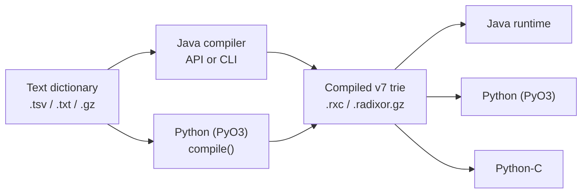

# Radixor Data Formats

Radixor separates editable lexical evidence from the compact artifact used for
runtime stemming. The same distinction applies across Java and both Python
runtimes.

## Format overview

| Form | Typical suffix | Purpose | Java | Python (PyO3) | Python-C |
|---|---|---|---|---|---|
| Text dictionary | `.tsv`, `.txt`, optionally `.gz` | Human-editable training data: stem followed by known forms | Read and compile | Read and compile | Not supported |
| Compiled Radixor trie v7 | `.rxc` or `.radixor.gz` | GZip-framed, self-describing runtime trie | Read and write | Read and write | Read |
| Standard model package | model JAR or `radixor-models-standard` wheel | Published collection of prepared models and metadata | Model JARs | Shared Python data wheel | Same shared Python data wheel |

Suffixes communicate intent; detection depends on the content. `.rxc` is the
usual Python name, while Java examples commonly use `.radixor.gz`. Both contain
the same GZip-compressed version 7 Radixor stream.

## Text dictionary

Each UTF-8 line begins with a canonical stem. Further fields are observed word
forms, separated by tab characters. The examples in this documentation use the
visible symbol **`⇥`** to represent one actual tab character:

```text
run ⇥ running ⇥ runs ⇥ ran
city ⇥ cities
```

`⇥` is a documentation symbol only; it must not be written to the dictionary.
Likewise, do not type the two characters `\t`. In the real file, press the Tab
key or configure the producing tool to emit a tab character (Unicode `U+0009`)
between fields.

This is source data, not a runtime lookup table. Radixor derives transformation
commands from the relationships and can apply learned commands beyond the
listed forms. See the [Dictionary Format](dictionary-format.md) for parsing,
comments, normalization and validation rules.

Create a compiled trie from text with one of these preparation tools:

- Java API or the [Java CLI](cli-compilation.md), for the complete compilation controls;
- `radixor.compile(...)`, documented under [Python model compilation](python/model-compilation.md).

Python-C deliberately does not compile text dictionaries. Compile once with
Java or `radixor`, then deploy the resulting binary to `radixor-c`.

## Compiled version 7 trie

“Version 7” identifies the serialization schema of a compiled Radixor model. It
is not the Radixor library version, the model release, or the language-catalog
version. A v7 stream begins with the `EGTR` format marker and a schema version,
then stores the trie, patch commands, and the metadata required to interpret
them consistently in another runtime.

The binary contains the reduced trie, patch commands and build metadata needed
for lookup, including traversal direction and normalization settings. It is the
preferred production artifact because application startup does not repeat text
parsing, command generation or trie reduction.

The decompressed v7 stream is interoperable:



The outer GZip bytes may differ between compressors without changing the model.
Only v7 is promised across the Python runtimes; Java also owns migration and
compatibility facilities for older project formats.

## Extending a model

There are two distinct workflows:

1. Add rows to a text dictionary and compile a new artifact. Java and
   `radixor` support this route.
2. Reopen an existing compiled trie, add transformations and rebuild it. This
   is currently a Java capability; see
   [Extending and Persisting Compiled Tries](programmatic-extending-and-persistence.md).

The rebuilt v7 artifact can then be consumed by all three runtimes, including
Python-C. Treat source dictionaries and compiled tries as versioned application
assets and regression-test domain vocabulary before deployment.
