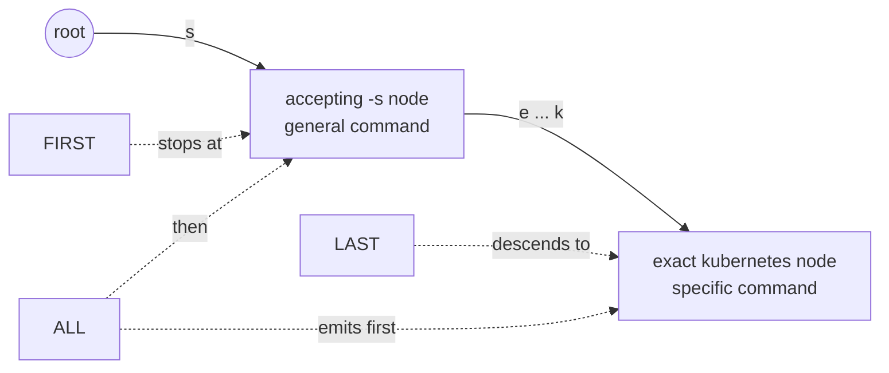

# Querying and Ambiguity Handling

This document explains how a compiled Radixor trie is queried and how ambiguity is represented.

## Query a compiled trie

### `get(...)`: preferred local value

`FrequencyTrie.get(String)` returns the most frequent value stored at the node addressed by the supplied key. If several values have the same local frequency, the winner is chosen deterministically by shorter `toString()` value first, then by lexicographically lower `toString()`, and finally by stable first-seen order. If the key does not exist or no value is stored at the addressed node, `null` is returned.

```java
final String word = "running";
final CompiledPatchCommand patch = trie.get(word);
```

### `getAll(...)`: ordered local values

`FrequencyTrie.getAll(String)` returns all values stored at the addressed node, ordered by descending frequency using the same deterministic tie-breaking rules. The returned array is a defensive copy. If the key is missing or has no local values, an empty array is returned.

```java
final CompiledPatchCommand[] patches = trie.getAll("axes");
```

### `getEntries(...)`: values with counts

`FrequencyTrie.getEntries(String)` returns immutable `ValueCount<V>` objects aligned with the same ordering used by `getAll(...)`.

```java
import java.util.List;

import org.egothor.stemmer.CompiledPatchCommand;
import org.egothor.stemmer.ValueCount;

final List<ValueCount<CompiledPatchCommand>> entries = trie.getEntries("axes");
```

### Visitor lookup for hot paths

For allocation-sensitive token loops, use the visitor-style lookup methods. They visit the same ordered local values and counts without allocating a result array, list, or `ValueCount` objects.

```java
trie.getAll("axes", (patch, count, rank) -> {
    // rank is zero-based and follows the same ordering as getAll(String).
    return true; // return false to stop after this callback
}, 8);
```

If the caller has already normalized the input exactly as required by `trie.metadata()`, the normalized methods avoid lookup normalization buffers too:

```java
final char[] token = "axes".toCharArray();
trie.getAllNormalized(token, 0, token.length, (patch, count, rank) -> {
    return true;
}, 8);
```

`getAllNormalized(...)` bypasses `caseProcessingMode` and `diacriticProcessingMode`; callers are responsible for supplying canonical input. `maxResults == 0` visits nothing, negative values are rejected, and a sink returning `false` stops iteration after the current callback.

## Selecting commands along the path: lookup mode

A key's path can pass through several value-bearing nodes: shallow contracted accepting nodes (suffix generalizations that accept any remaining input) and, when the key is fully consumed, a deep exact terminal. `LookupMode` decides which of these the `get` / `getAll` family selects. `FrequencyTrie.withLookupMode(LookupMode)` returns a lightweight view over the same immutable compiled structure; the policy is a read-time concern and is never persisted, so one trie can be queried under any mode.

- `LookupMode.FIRST` (default) — the shallowest accepting node short-circuits descent. This is the historical behavior; the bundled models are validated against it.
- `LookupMode.LAST` — the deepest, most specific match wins, with the deepest accepting ancestor as a fallback when descent dead-ends. Use this so a specific rule added beneath a suffix generalization takes effect.
- `LookupMode.ALL` — `getAll` returns every applicable command along the path, most specific first; scalar `get` returns the most specific one.



```java
import org.egothor.stemmer.CompiledPatchCommand;
import org.egothor.stemmer.LookupMode;

final CompiledPatchCommand specific = trie.withLookupMode(LookupMode.LAST).get("kubernetes");
final CompiledPatchCommand[] candidates = trie.withLookupMode(LookupMode.ALL).getAll("kubernetes");
```

For the bundled models, `FIRST` and `LAST` return identical results everywhere except where a specific rule sits beneath a generalization — their contracted rules have no deeper branch — so switching modes does not change ordinary stemming or the benchmarks. Adding such specific rules is covered in [Extending and Persisting Compiled Tries](programmatic-extending-and-persistence.md).

## Apply compiled patch commands

A patch command is not the final stem. It must be applied to the original input token. Runtime code should use `CompiledPatchCommand`, which parses the stored patch-command representation once during setup and then applies the concrete immutable command repeatedly.

```java
import org.egothor.stemmer.CompiledPatchCommand;

final String word = "running";
final CompiledPatchCommand patch = trie.get(word);
final String stem = patch == null ? word : patch.apply(word);
```

Hot paths can apply a patch into caller-owned character storage:

```java
final char[] output = new char[32];
final int produced = patch.applyTo(
        word,
        output,
        0,
        output.length);

if (produced != CompiledPatchCommand.APPLY_INSUFFICIENT_CAPACITY) {
    final String stem = new String(output, 0, produced);
}
```

`applyTo(...)` returns the produced character count on success and `APPLY_INSUFFICIENT_CAPACITY` when the output range is too small. Capacity failure does not write partial output. The source and output ranges of the `char[]` overload must not overlap.

For multiple candidates:

```java
final String word = "axes";
for (final CompiledPatchCommand patch : trie.getAll(word)) {
    final String stem = patch.apply(word);
    System.out.println(word + " -> " + stem + " (" + patch + ")");
}
```

The historical `PatchCommandEncoder.apply(...)` API still exists for compatibility with code that directly handles serialized patch-command strings, but it is deprecated because it reparses the command on every call. See [Migration and Backward Compatibility](migration-and-backward-compatibility.md) for the old and new forms side by side.

## Understand reduction modes

Reduction mode determines how mutable subtrees are merged during compilation. All modes operate on full subtree semantics rather than only on local node content.

### `MERGE_SUBTREES_WITH_EQUIVALENT_RANKED_GET_ALL_RESULTS`

This mode merges subtrees whose `getAll()` results are equivalent for every reachable key suffix and whose local result ordering is the same. It ignores absolute frequencies when comparing subtree signatures, but it preserves ranked multi-result ordering semantics.

### `MERGE_SUBTREES_WITH_EQUIVALENT_UNORDERED_GET_ALL_RESULTS`

This mode also merges according to `getAll()` equivalence for every reachable key suffix, but it ignores local result ordering in addition to absolute frequencies. It is therefore more aggressive in what it considers equivalent.

### `MERGE_SUBTREES_WITH_EQUIVALENT_DOMINANT_GET_RESULTS`

This mode focuses on `get()` equivalence for every reachable key suffix, subject to dominance constraints. If a node does not satisfy the configured dominance thresholds, the implementation falls back to ranked `getAll()` semantics for that node to avoid unsafe over-reduction. The thresholds are configured through `ReductionSettings`. Defaults are 75 percent minimum winner share and a winner-over-second ratio of 3.

## Practical guidance

- choose a ranked `getAll()` mode when downstream ambiguity handling matters,
- choose the dominant `get()` mode when the primary operational concern is the preferred result,
- treat reduction mode as part of observable lookup semantics, not merely as an internal compression setting.

## Continue with

- [Extending and Persisting Compiled Tries](programmatic-extending-and-persistence.md)
- [Loading and Building Stemmers](programmatic-loading-and-building.md)
