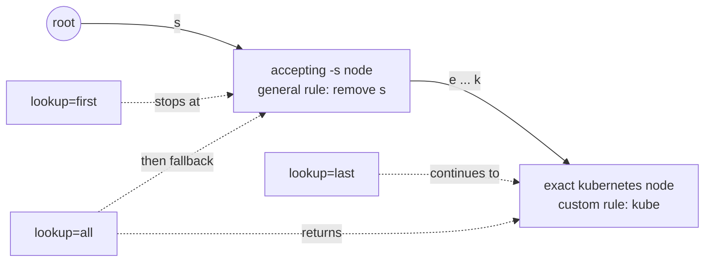

# Customizing a dictionary in Python

A compiled Radixor model already stems general language well. Real corpora also
contain words that the general rules handle badly: brand and product names,
trademarks, domain jargon, and spelling variants you want to normalize. The
`TrieBuilder` lets you open an existing model, add your own `word → stem` rules,
and materialize a new stemmer or a new compiled dictionary — without recompiling
a whole source dictionary from scratch.

Typical goals this page covers:

- **Protect a brand or trademark** from being over-stemmed (`Windows` should not
  collapse to `window`).
- **Add domain vocabulary** with a chosen canonical stem (`kubernetes → kube`).
- **Normalize spelling variants** onto one form (`postgresql → postgres`).
- **Fill gaps** without touching curated entries.
- **Remove** a rule you no longer want.

## Open a model as a builder

A `TrieBuilder` is opened the same three ways as a `Stemmer`, plus a shortcut
from an existing stemmer:

```python
from radixor import Stemmer, TrieBuilder

builder = TrieBuilder("en")                     # a bundled language model
builder = TrieBuilder(compiled="en.rxc")        # a compiled .rxc trie
builder = TrieBuilder(path="custom.tsv.gz")     # a textual source dictionary
builder = Stemmer("en").to_builder()            # reopen a stemmer's source
```

Opening a **compiled** model reconstructs its rules faithfully, including the
contracted suffix generalizations (see [below](#why-custom-rules-need-lookuplast)).
An unmodified round-trip preserves the original observable lookup results,
candidate ordering, and aggregate counts; it does not promise a byte-identical
serialization or recover the pre-reduction insertion history.

`TrieBuilder` is mutable and is not safe for concurrent mutation. `build()`
captures an immutable snapshot: later changes to the builder do not affect a
stemmer that has already been built, including when that stemmer's cache is
resized.

## Why custom rules need `lookup="last"`

A compiled model generalizes suffix rules. The English model, for example,
contracts the `-s` plural into one rule that strips a trailing `s` from **any**
word — including words it has never seen. That is why an unknown word still
stems:

```python
s = Stemmer("en")
s.stemWord("windows")     # 'window'  -> the general -s rule fired
s.stemWord("redis")       # 'redi'    -> same
```

When you add a rule for such a word, the general rule and your specific rule sit
at different depths on the same lookup path. A `lookup` policy decides which one
wins:

| `lookup` | Which rule wins | Use it when |
| --- | --- | --- |
| `"first"` (default) | the shallowest, most general rule short-circuits | you want the legacy behavior; standard models are validated against it |
| `"last"` | the deepest, most specific rule wins; the general rule is a fallback | **you added custom rules and want them to take effect** |
| `"all"` | `stem_all` returns every candidate on the path, most specific first | you want to inspect all applicable rules |

The mode is chosen when you build the stemmer:

```python
builder = Stemmer("en").to_builder().add("kubernetes", "kube")

builder.build(lookup="first").stemWord("kubernetes")   # 'kubernete' -> -s rule shadows it
builder.build(lookup="last").stemWord("kubernetes")    # 'kube'      -> your rule wins
builder.build(lookup="all").stem_all("kubernetes")     # ['kube', 'kubernete']
```

The following backward (suffix) path shows why the modes differ. The accepting
`-s` node remains a valid fallback; the custom terminal adds a more-specific
branch without mutating or weakening that generalization.



!!! info "Standard models are unaffected by `last`"
    For the bundled models, `"first"` and `"last"` return identical results
    everywhere except where you added a specific rule under a generalization.
    Their contracted rules have no deeper branch, so switching to `"last"` does
    not change ordinary stemming or the benchmarks.

You can also set `lookup` directly on a `Stemmer`, for example when loading a
compiled custom dictionary:

```python
Stemmer(compiled="custom-en.rxc", lookup="last").stemWord("kubernetes")   # 'kube'
```

## The update operations

`add` is the everyday operation; `set`, `remove`, and the `add` keyword options
cover the rest. Each returns the builder, so calls chain.

| Operation | Effect at the word's node | Keeps other candidates? |
| --- | --- | --- |
| `add(word, stem)` | make the rule **dominant** (the stem returned) | yes — visible in `stem_all` under `"all"` |
| `add(word, stem, count=N)` | add a raw frequency `N` (may or may not out-rank an existing rule) | yes |
| `add(word, stem, only_if_absent=True)` | store the rule **only if the word has no rule yet** | n/a (only acts on empty nodes) |
| `set(word, stem)` | **replace** every rule at the node with this one | no — alternatives discarded |
| `remove(word)` | delete every rule at the word's exact node | — |
| `remove(word, stem)` | delete one specific rule at the word's node | keeps the rest |

The important distinction is `add` (default) versus `set`: both make your rule
win under `"last"`, but `add` keeps the model's prior candidate as a lower-ranked
alternative, while `set` discards it.

With the default `store_original=True`, `add(word, stem)` and `set(word, stem)`
also register an identity rule for the canonical `stem`, using the same update
policy. This makes the canonical form recognize itself. Pass
`store_original=False` when opening the builder if the customization must touch
only the surface-word node. `remove(word, stem)` always removes only the encoded
rule at `word`; it does not remove the canonical stem's identity rule.

```python
b = Stemmer("en").to_builder().add("windows", "windows")
b.build(lookup="last").stemWord("windows")     # 'windows'
b.build(lookup="all").stem_all("windows")      # ['windows', 'window'] -> alternative kept

b = Stemmer("en").to_builder().set("windows", "windows")
b.build(lookup="all").stem_all("windows")      # ['windows'] -> alternative discarded
```

## Worked examples

### Protect a brand from over-stemming

`add(word, word)` maps a word to itself. Under `"last"` it stops the general
rule from rewriting the brand, while leaving every other word alone:

```python
builder = Stemmer("en").to_builder()
builder.add("windows", "windows").add("redis", "redis")

stemmer = builder.build(lookup="last")
stemmer.stemWord("windows")                    # 'windows'  (was 'window')
stemmer.stemWord("redis")                      # 'redis'    (was 'redi')
stemmer.stem_batch(["cats", "dogs", "running"])  # ['cat', 'dog', 'run'] -> unaffected
```

### Add domain vocabulary with a chosen stem

Map several surface forms of a term onto one canonical stem:

```python
builder = Stemmer("en").to_builder()
builder.add("kubernetes", "kube").add("kuberneting", "kube")

stemmer = builder.build(lookup="last")
stemmer.stemWord("kubernetes")                 # 'kube'
stemmer.stemWord("kuberneting")                # 'kube'
```

### Normalize spelling variants

```python
builder = Stemmer("en").to_builder()
builder.add_many([("postgresql", "postgres"), ("postgre", "postgres")])

stemmer = builder.build(lookup="last")
stemmer.stem_batch(["postgresql", "postgre", "postgres"])
# ['postgres', 'postgres', 'postgres']
```

### Fill gaps without overwriting curated entries

`only_if_absent=True` adds a rule only where the word has no rule yet, so it
never disturbs the model's existing decisions:

```python
builder = Stemmer("en").to_builder()
builder.add("windows", "windows", only_if_absent=True)   # 'windows' has a rule -> unchanged
builder.add("zzgadget", "gadget", only_if_absent=True)   # a new word -> stored

stemmer = builder.build(lookup="last")
stemmer.stemWord("windows")                    # 'window'  (untouched)
stemmer.stemWord("zzgadget")                   # 'gadget'
```

### Remove a rule

```python
builder = Stemmer("en").to_builder().add("gitlab", "git")
builder.build(lookup="last").stemWord("gitlab")   # 'git'

builder.remove("gitlab")
builder.build(lookup="last").stemWord("gitlab")   # 'gitlab'
```

## Persist a custom dictionary

Materialize the builder once and reuse the compiled artifact:

```python
builder = Stemmer("en").to_builder().add("windows", "windows")

builder.save("custom-en.rxc")                  # write a compiled v7 trie
data = builder.to_bytes()                       # or get the image as bytes
```

The written file is a gzip-wrapped version 7 trie, byte-compatible (inner
stream) with the Java `StemmerPatchTrieBinaryIO` format, so Java and Python can
share it. Load it back with either runtime and choose the lookup policy at load
time:

```python
Stemmer(compiled="custom-en.rxc", lookup="last").stemWord("windows")   # 'windows'
```

See [Compiling Dictionaries in Python](model-compilation.md) for the compiled
format and [Dictionary Format](../dictionary-format.md) for the textual source
specification.

## Gotchas

!!! warning "`remove` targets the exact word, not a generalization"
    `remove(word)` deletes the rule stored at the word's **own** node. A word
    that stems only through a shorter contracted generalization has no rule of
    its own to delete, so `remove` does nothing for it. To change such a word,
    override it with `set(word, stem)` (or `add`) and read with `lookup="last"`;
    to drop the generalization itself you would have to target the shorter
    suffix, which affects every word it covers.

    Removing the generalization key itself is supported. When its last value is
    removed, the builder also clears the node's “accept remaining input” marker,
    so the rebuilt trie remains structurally valid.

!!! info "`add` weight versus `set`"
    `add` (default) makes your rule the top-ranked candidate by giving it a
    frequency just above the others, so `stem_all` still lists the alternatives.
    `add(count=N)` adds a literal frequency `N` that may lose to an existing
    higher-frequency rule. `set` sidesteps ranking entirely by discarding the
    other values. When in doubt, use `add` for “prefer this” and `set` for
    “this and nothing else”.

## API summary

| Call | Returns | Notes |
| --- | --- | --- |
| `TrieBuilder(language=None, *, path=..., compiled=..., backward=None, store_original=True, lowercase=True)` | builder | open a model as a builder |
| `TrieBuilder.from_bytes(data, *, backward=None, store_original=True, lowercase=True)` | builder | open from an in-memory image |
| `Stemmer.to_builder()` | builder | reopen a stemmer's source |
| `add(word, stem, *, count=None, only_if_absent=False)` | `TrieBuilder` | default makes the rule dominant |
| `add_many(pairs, *, count=None, only_if_absent=False)` | `TrieBuilder` | same options applied to every pair |
| `set(word, stem)` | `TrieBuilder` | replace all rules at the word's node |
| `remove(word, stem=None)` | `TrieBuilder` | delete all rules, or one specific rule |
| `build(cache_size=10_000, lookup="first")` | `Stemmer` | materialize; choose the lookup policy |
| `save(out_path)` | `None` | write a compiled v7 trie |
| `to_bytes()` | `bytes` | compiled v7 image |
