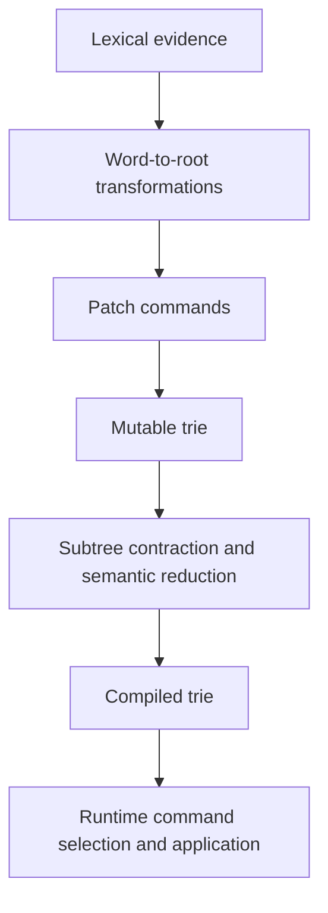

# Why Radixor Is Different

Radixor is **dictionary-trained, not dictionary-bound**.

The source dictionaries are build-time evidence from which Radixor learns
word-to-stem transformations. The runtime artifact is not a flat table that can
only answer words already present in that evidence. It is a compact,
deterministic **trie of patch commands**.

That distinction is the shortest way to understand the project.

## A learned transformation stemmer

A conventional dictionary lookup stores a relationship such as:

```text
running -> run
```

Radixor instead derives a transformation that can be represented conceptually as:

```text
running -> <patch command> -> run
```

Many word forms share the same transformation behaviour. Radixor organizes those
commands in a trie, reduces structurally equivalent regions, contracts uniform
preferred-command subtrees, and freezes the result into an immutable compiled
runtime structure.

The pipeline is therefore:



The dictionary is important because it supplies the linguistic evidence. It does
**not** define a closed runtime vocabulary.

## What happens to an unseen word?

The compiled trie selects transformation behaviour rather than storing a full
lemma string for every possible input.

Uniform subtrees can be contracted into accepting leaves. When lookup reaches an
accepting leaf whose preferred patch command is already determined, the runtime
can apply that command even with input characters remaining. This is one of the
ways the compiled model can generalize beyond explicitly observed dictionary
forms.

Generalization is not a promise that every arbitrary unknown token has a useful
stem. No practical stemmer can make that guarantee. The important property is
that Radixor is **not limited to exact dictionary membership**.

For the implementation details, see [Architecture](architecture.md).

## Why patch commands matter

Patch commands encode *how to transform* a word rather than merely *which string
to return*.

That gives the runtime model several useful properties:

- repeated transformation behaviour can be shared;
- trie paths share structural information between related inputs;
- equivalent subtrees can be reduced;
- the final command is applied directly to the original token;
- the runtime can expose a deterministic preferred result;
- the same compiled node may retain ranked alternative commands when ambiguity
  should not be discarded.

The result is closer to a compact learned transformation machine than to either a
flat dictionary or a handwritten suffix list.

## Why the trie matters

The trie is not just a storage container around a dictionary.

It is the structure that makes the learned transformations reusable. Shared
paths represent shared input structure; reduction merges equivalent behaviour;
uniform-subtree contraction can terminate preferred-result lookup early.

This is also why the source dictionary may be very large while the deployed
representation remains compact and fast.

## Radixor is not three common things

### It is not a closed dictionary lemmatizer

A closed dictionary lemmatizer primarily asks whether the current surface form
exists in a lexicon or automaton and, if it does, returns stored analyses.

Radixor uses lexical resources differently: it **compiles transformation
behaviour from them**.

### It is not another fixed suffix-rule stemmer

Porter- and Snowball-family stemmers encode explicit rules for a language.
Those systems can generalize because the rules apply to unseen text, but the
rules themselves are fixed algorithmic knowledge.

Radixor learns its transformation behaviour from language data and then compiles
that behaviour into its runtime trie.

### It is not a full morphological analyzer

A full analyzer may return lemmas, parts of speech, grammatical tags, and
multiple analyses. That is valuable when applications need morphological
interpretation.

Radixor has a narrower search-oriented objective: produce compact, high-quality
term conflation with predictable runtime cost. It can preserve multiple stemming
candidates, but it does not attempt to become a general-purpose morphological
analysis framework.

## What is distinctive about the combination

Any one ingredient in isolation is familiar:

- dictionaries are familiar;
- tries are familiar;
- string edit commands are familiar;
- subtree reduction is familiar.

The distinctive architecture is their **combination**:

> lexical evidence → patch commands → trie organization → semantic reduction →
> compact deterministic runtime transformation

That architecture separates expensive learning and compilation from hot-path
runtime work.

## Modern Radixor adds more than the historical implementation

Radixor preserves the useful Egothor idea while rebuilding the operational model
for current software:

- immutable compiled tries;
- compiled patch-command objects rather than repeated textual interpretation;
- deterministic ranked multi-result lookup;
- configurable reduction semantics;
- uniform-subtree contraction;
- binary persistence;
- independent language-model versioning and integrity verification;
- reopening and extending compiled structures;
- a flagship Java runtime plus native Python and Python-C runtimes;
- reproducible quality and performance benchmark infrastructure.

For the historical lineage and how Stempel, Morfologik, Snowball, and other
comparators relate to this architecture, continue with
[Technology and Lineage](technology-lineage.md).
